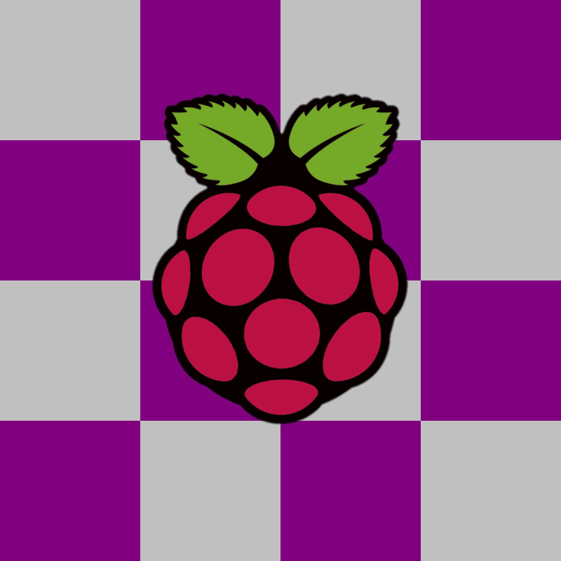

# Winelink
A [Winlink](http://winlink.org/) (RMS Express & VARA) installer Script for the Raspberry Pi 4.

_This project is very early in development. It has lots of bugs and should be considered [alpha](https://en.wikipedia.org/wiki/Software_release_life_cycle#Alpha) software._

## Installation
Copy/paste these commands into your Raspberry Pi 4's terminal:
```bash
curl -O https://raw.githubusercontent.com/WheezyE/Winelink/main/install_winelink.sh && \
     bash install_winelink.sh
```
 - A full installation takes about 30 minutes (with user prompts) and lots of errors will appear in the terminal (just ignore those).
 - If desired, you can tell the script to only install VARA by running `curl -O https://raw.githubusercontent.com/WheezyE/Winelink/main/install_winelink.sh && bash install_winelink.sh vara_only`

## Examples
")
VARA running on a Raspberry Pi 4B (Twister OS)

## How it works
This script will help you install Box86, Wine, winetricks, Windows DLL's, RMS Express, & VARA.  You will then be prompted to configure RMS Express & VARA to send/receive audio from a USB sound card plugged into your Pi.  This installer will only work on the Raspberry Pi 4B for now (support for earlier Raspberry Pi models is planned for later).

To run Windows .exe files on RPi4 (ARM/Linux), we need an x86 emulator ([Box86](https://github.com/ptitSeb/box86)) and a Windows API Call interpreter ([Wine](https://github.com/wine-mirror/wine)).  Box86 is open-source and runs about 10x faster than [ExaGear](https://www.huaweicloud.com/kunpeng/software/exagear.html) or [Qemu](https://github.com/qemu/qemu).  ExaGear is also closed source abandonware and Qemu (qemu-system & qemu-user-static) also has issues running more complex Wine programs on the Pi.  Box86 is much smaller in file size and much easier to install too.

## Known issues
 - ARDOP & VARA often have trouble connecting to RMS Express over TCP when they first start. If ARDOP fails to connect, just restart RMS Express it until it does connect (this is a bug in wine).
 - VARA's CPU gauge doesn't display (this is a bug in wine).
 - I haven't tested over-the-air connections since I'm just a tech.  If some generals could test, that would be awesome.
 - RMS Express v1.5.41.0 introduced a requirement for .NET 4.6 (instead of just .NET 3.5sp1). This updated has forced us to use wine-mono instead of .NET.  Wine-mono may have some bugs. Madewokherd (Esme), the wine-mono dev, is amazing though - they have fixed all of the bugs we've encountered so far.
    
## Credits
 - [ptitSeb](https://github.com/ptitSeb/box86) for box86 debugging (& everyone on [the TwisterOS discord](https://discord.gg/Fh8sjmu))
>      (ptitSeb, pale, chills340, Itai-Nelken, Heasterian, phoenixbyrd,
>       monkaBlyat, lowspecman420, epychan, !FlameKat53, #lukefrenner,
>       icecream95, SpacingBat3, Botspot, Icenowy, Longhorn, et.al.)

 - [madewokherd](https://github.com/madewokherd/wine-mono) (Esme) for wine-mono debugging
 - N7ACW, AD7HE, & KK6FVG for getting me started in ham radio
 - [KM4ACK](https://github.com/km4ack/pi-build) & OH8STN for inspiration
 - [K6ETA](http://k6eta.com/linux/installing-rms-express-on-linux-with-wine) & [DCJ21](https://dcj21net.wordpress.com/2016/06/17/install-rms-express-linux/)'s 'Winlink on Linux' guides for early proof-of-concept

         "My humanity is bound up in yours, for we can only be human together"
                                                     - Nelson Mandela

## Legal
All software used by this script is free and legal to use (with the exception of VARA, of course, which is shareware).  Box86, Wine, wine-mono, winetricks, and AutoHotKey, are all open-source (which avoids the legal problems of use & distribution that ExaGear had - ExaGear also ran much slower than Box86 and is no-longer maintained, despite what Huawei says these days).  All proprietary Windows DLL files required by Wine are downloaded directly from Microsoft and installed according to their redistribution guidelines.  Raspberry Pi is a trademark of the Raspberry Pi Foundation

## Future work
 - [ ] Add updated example images.
 - [ ] Add an AHK script to help the user with ARDOP first time soundcard setup.
 - [ ] Consider adding a sed script to find/delete any small-value frequencies in `RMS Channels.dat` that would crash the HF Channel Selection Browser
 - [ ] Clean up code with [Google style guide](https://google.github.io/styleguide/shellguide.html).
 - [ ] Work with the Wine team to [figure out why VARA's CPU gauge isn't working](https://bugs.winehq.org/show_bug.cgi?id=50728).
 - [ ] Work with the Wine team to [figure out why ARDOP & VARA don't always connect to RMS Express over TCP when first starting](https://bugs.winehq.org/show_bug.cgi?id=52521).
 - [ ] Add 'splash screen' to RMS Express desktop shortcut (since launching takes a while)
 - [x] Rely on [archive.org box86 binaries](https://archive.org/details/box86.7z_20200928) instead of compiling.
    - [ ] Give user the choice to compile or not.
    - [ ] Add auto-detection of failed downloads, then switch to compiling as contingency.
 - [x] Test COM port connections to radio ("CAT" control, PTT).
 - [x] Work with madewokherd to see if wine-mono bugs can be fixed (would drastically improve install speed).
    - [x] [ARDOP TCP/IP Connection issues](https://github.com/madewokherd/wine-mono/issues/116).
    - [x] [Message creation issues](https://github.com/madewokherd/wine-mono/issues/122).
    - [x] [Message receive issues](https://github.com/madewokherd/wine-mono/issues/122#issuecomment-962525136).
    - [x] [HF Channel Selection Browser crash](https://github.com/WheezyE/Winelink/issues/16) (from small-value input frequencies).
    - [x] [COM port connection issues to radios/TNC's](https://github.com/WheezyE/Winelink/issues/17).
 - [x] Ask Seb for help getting VARA Chat running in box86.
 - [x] Add option (or check) for running the script via SSH (currently ssh causes wine to not display Windows) - Fixed with X11 check.
 - [x] Add installer for VARA FM.
 - [x] Add a check for sudo priviledges? Add a check to make sure script is not run as sudo?
 - [x] Change VARA Setup/Config terminal text prompts into zenity pop-up boxes.
    - [x] Change all terminal text prompts into text boxes?
 - [x] Add more error-checking to the script.
 - [x] Make a logo for the github page.
 - [x] Make the script's user-interface look better.
 - [x] Add an AHK script to click the "Ok" button after VARA is installed.
 - [x] Add an AHK script to help the user with VARA first time soundcard setup.
 - [x] Add more clean-up functions to the script.
 - [x] Have the script download all files into the cloned repository directory (instead of into ~/Downloads)
 - [x] Add shortcuts to the desktop.
 - [x] Work with the Wine team to find [graphical errors in VARA](https://forum.winehq.org/viewtopic.php?f=8&t=34910).
 - [x] Add the fix for VARA graphical errors to the script.
    - [x] Re-fix the VARA graphics errors using a different method ([winecfg reg keys](https://wiki.winehq.org/index.php?title=Useful_Registry_Keys&highlight=%28registry%29)).
  - [x] Add pdhNT4 to [winetricks](https://github.com/Winetricks/winetricks) to streamline this installer.
  - [x] Make code modular to help readability.
 - [x] Simplify installation commands (model after KM4ACK BAP).
 #### Add more platforms (make a multi-platform [Wine](https://wiki.winehq.org/Download) installer & build/invoke box86 if needed).
 - [x] Auto-detection of system arch (x86 vs armhf vs aarch64) & OS.
    - ARM
      - [x] Raspberry Pi 4B
      - [ ] Raspberry Pi 3B+
        - [ ] Detect Raspberry Pi kernel memory split (and install the correct kernel if needed) for RPi <4 support.
        - [ ] Ask Botspot if I can borrow some of his [pi-apps code](https://github.com/Botspot/pi-apps/blob/4a48ba62b157420c6e33666e7d050ee3ce21ab0b/apps/Wine%20(x86)/install-32#L165).
      - [ ] RPi Zero 2 W?
      - [ ] RPi Zero W?
      - [ ] [Termux](https://github.com/termux/termux-app) (Android without root) ([proot-distro](https://github.com/termux/proot-distro) + Ubuntu ARM + [termux-usb](https://wiki.termux.com/wiki/Termux-usb)) - see [AnBox86](https://github.com/lowspecman420/AnBox86) for proof of concept, currently untested with VARA.
        - [x] Fix AnBox86
    - x86
      - Mac
        - [ ] OSX?
      - Linux
        - [ ] Debian (Package manager: apt)
          - [ ] Deepin
          - [ ] Kali
        - [ ] Ubuntu (Package manager: apt)
          - [x] Linux Mint
          - [ ] Elementary OS
          - [ ] Zorin OS
        - [ ] Arch (Package manager: pacman, libalpm)
          - [ ] Vanilla Arch??
          - [ ] Manjaro
          - [ ] XeroLinux
          - [ ] SteamOS? (Steam Deck)
        - [ ] Red Hat (Package manager: yum, RPM)
          - [ ] Fedora (Package manager: RPM/DNF)
          - [ ] CentOS (Package manager: yum)
        - [ ] Slackware (Package manager: pkgtool, slackpkg)
        - [ ] FreeBSD (Package manager: pkg)
        - [ ] Gentoo (Package manager: Portage)
        - [ ] Solus (Package manager: eopkg)
        - [ ] openSUSE (Package manager: ZYpp (standard); YaST (front-end); RPM (low-level))
      - [ ] ChromeBook Linux beta.
        - [ ] Try to detect if processor would be too slow?
 - [ ] Make a youtube video showcasing current methods (box86, Exagear issues, qemu-user-static errors, Pi4B, Pi3B+, Termux, Mac, Linux, ChromeOS)
 
 - Android testing notes (Termux/PRoot/AnBox86_64)
     - [x] Proof of concept https://youtu.be/FkeP_IW3GGQ?t=23
     - [x] Audio in/out (ARDOP works with alsa / hiccups with pulseaudio)
     - [ ] Speed benchmarks with different devices (Fire HD10 Tablet is a bit slow, Retroid Pocket 2 TBD)
     - [ ] OTG-USB-CAT (order OTG_USB_C-USB)
     - [ ] Create alpha version of Winelink for AnBox86_64

## Distribution
If you use this script in your project (or are inspired by it) just please be sure to mention ptitSeb, Box86, and myself (KI7POL).  This script is free to use, open-source, and should not be monetized (for further information see the [license file](LICENSE)).

## Donations
If you feel that you are able and would like to support this project, please consider sending donations to ptitSeb, madewokherd (CodeWeavers/WineHQ), or KM4ACK - without whom, this script would not exist.
 - Sebastien "ptitSeb" Chevalier (author of [Box86](https://github.com/ptitSeb/box86), incredible developer, & really nice guy) [paypal.me/0ptitSeb](paypal.me/0ptitSeb)
 - Madewokherd (author [wine-mono](https://github.com/madewokherd/wine-mono) & a wonderful person) [https://www.winehq.org/donate](https://www.winehq.org/donate)
 - Jason "KM4ACK" Oleham (author of [Build-a-Pi](https://github.com/km4ack/pi-build), Linux elmer, & ham radio pioneer) [paypal.me/km4ack](paypal.me/km4ack)
